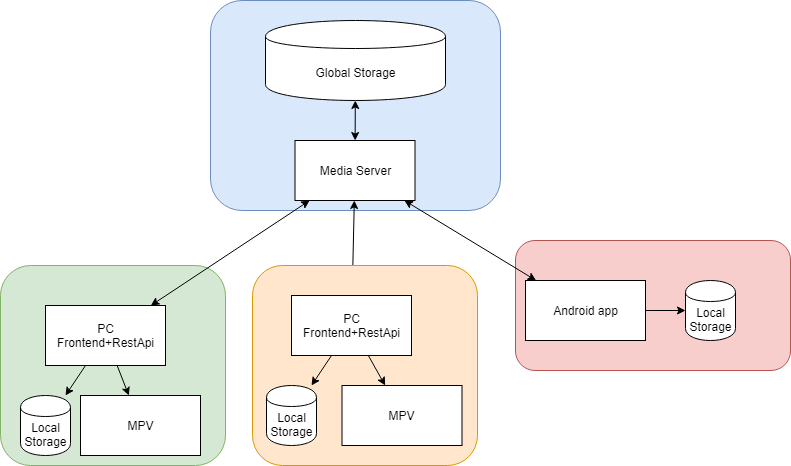

# SnackTime

## Architecture

### Blue Square
This is a Raspberry PI server, running Sonarr, Radarr, and a torrent
#### Media Server
A program to sync local storage to the global storage, also works a service to download files from.
#### Global storage
Here is the **Global** state of what has been seen and when. Here is also all the media source files.

### Red Square
This is supposed to illustrate a phone
#### Android app
This is a app written in flutter, it only supports android ATM
#### Local storage
Here is the **local** state of what has been seen and when. This only contains media files already downloaded from the media server.

### Green/Yellow Square
This is two PC.
#### Frontend+RestApi
This is a application to see what is available to download/watch. It will be the only UI where all functional is implemented

## Why 

## Features

### Plans

## Development
